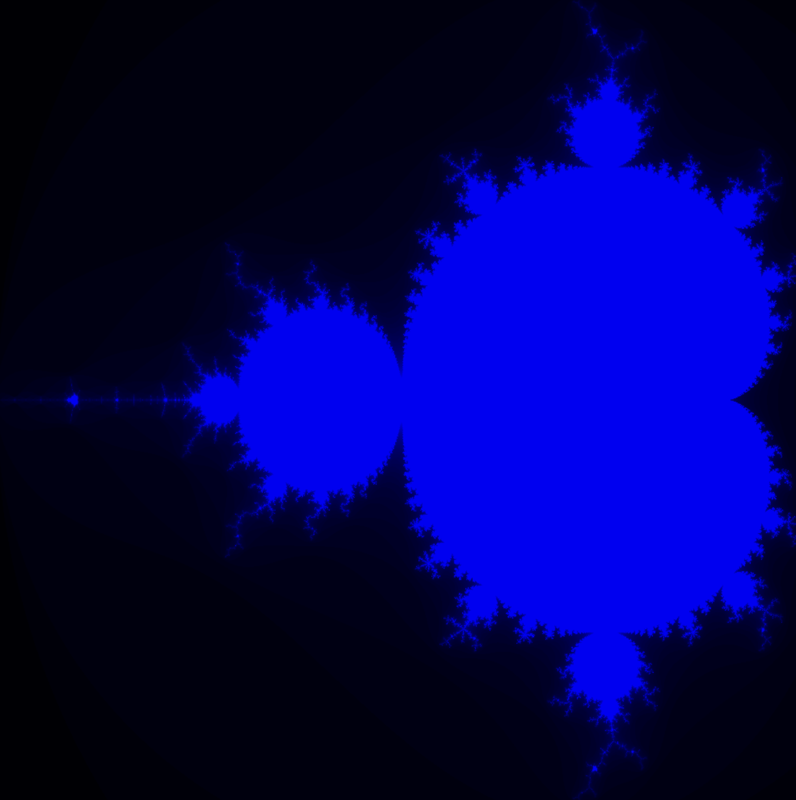
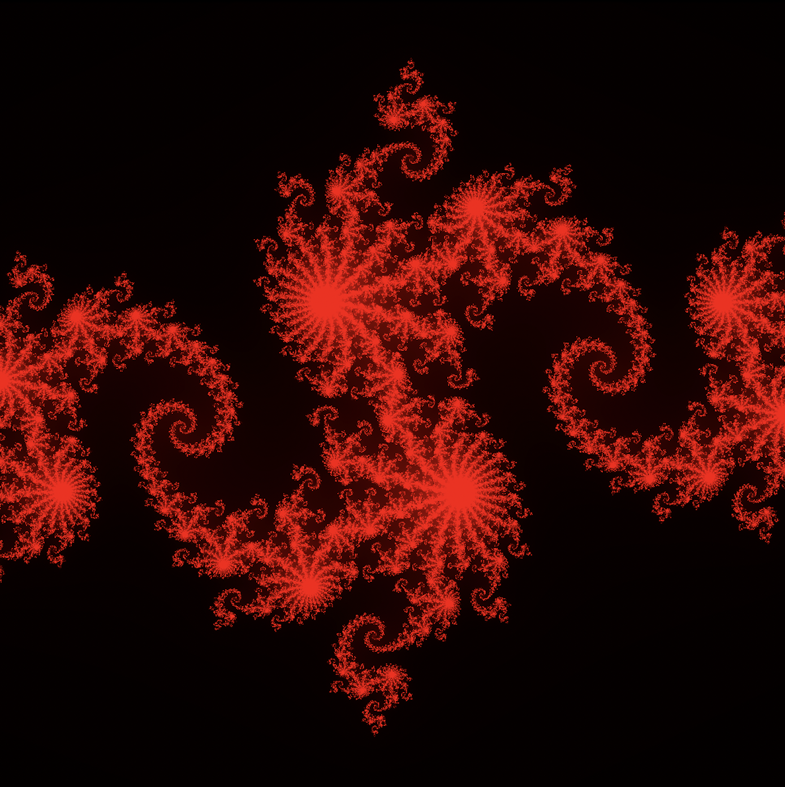
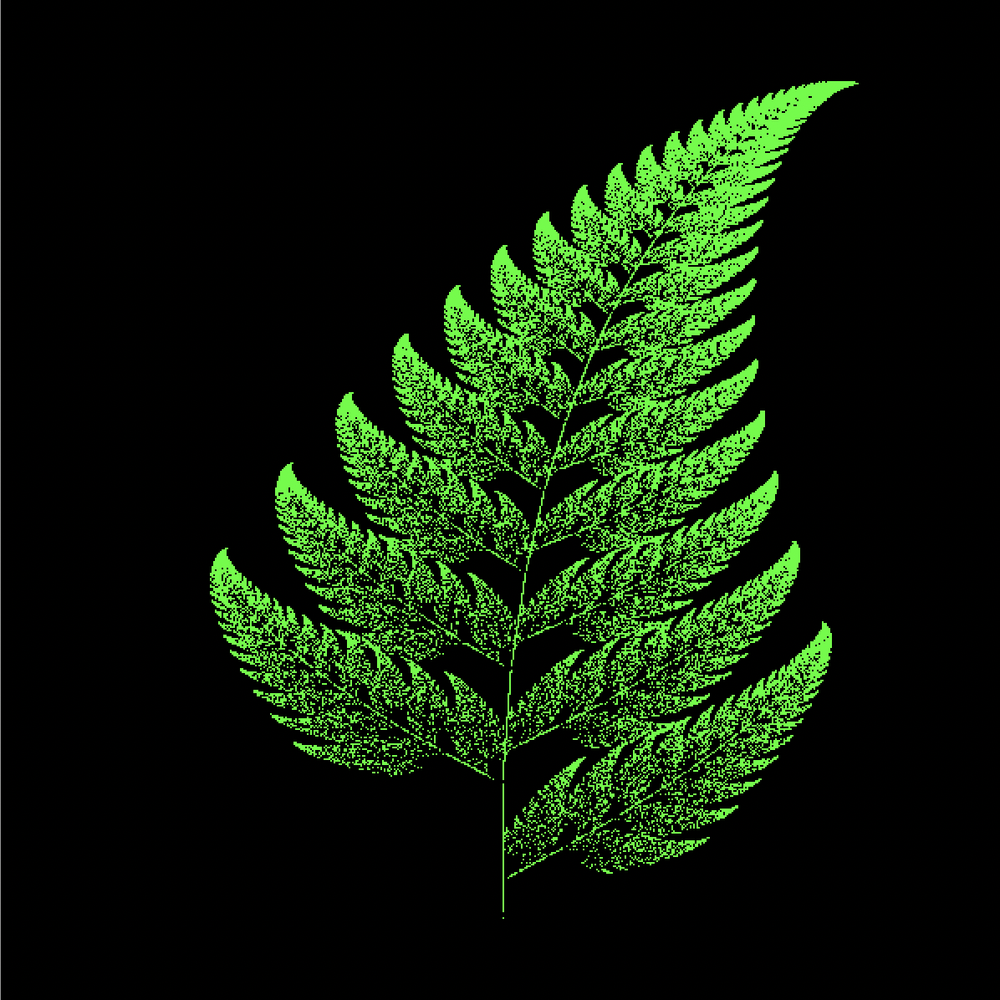
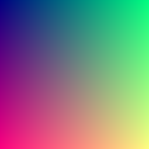

<h1 align="center">szimg</h1>
<p align="center">Light weight image library which focus on plotting!</p>

# Overview

type `cargo run --example <example_name>` in your terminal to see these example images crafted by our library.

<table>
  <tr>
    <td align="center">
      
    </td>
    <td align="center">
      
    </td>
    <td align="center">
      
    </td>
  </tr>
  <tr>
    <td align="center">
      <a href="./examples/mandlebrot.rs">mandlebrot</a>
    </td>
    <td align="center">
      <a href="./examples/julia.rs">julia_set</a>
    </td>
    <td align="center">
      <a href="./examples/barnsley_fern.rs">barnsley_fern</a>
    </td>
  </tr>
</table>


# Usage

To save a specified format image file, you need to prepare your data in Rust's raw multi-dimension array. That is because each channel data of your image file **must have same size**(both width and height). With raw array Rust compiler can easily check if your data have satisfied this constraint.

For example, if you want to save a PNG format file:

```rust
use szimg::png::save_png;

fn main() {
  let mut png_array = [[[0_u8; 3]; 255]; 255];
  for outer_index in 0..255 {
    for inner_index in 0..255 {
      png_array[outer_index][inner_index][0] = outer_index as u8;
      png_array[outer_index][inner_index][1] = inner_index as u8;
      png_array[outer_index][inner_index][2] = 128;
    }
  }
  save_png("rgb.png", png_array).unwrap();
}
```

You will get:

<p align="center"></p>

For more exmaples you can check the test folder. In the near future the cargo doument will be supported as well.


# Roadmap

- [x] Netpbm
- [x] PNG
- [x] JPEG
- [ ] GIF
- [x] BMP
- [ ] TIFF
- [ ] AVIF

All pull requests of other format images are welcome.


# License

[Apache-2.0 License](LICENSE)

Copyright (©) 2021 Sh-Zh-7

